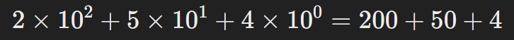
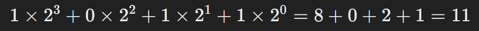
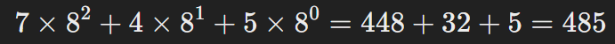
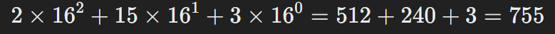

# Sistemas Numéricos

Un sistema numérico tiene como objetivo el permitir el conteo de los elementos de un conjunto. El sistema se conforma por `n` unidades en orden sucesivo que aumentan de `n` en `n`. De acuerdo a `n` se define el número de unidades que se necesitan para pasar de un orden a otro.

Una de las condiciones para utilizar algún sistema numérico es el que permita realizar operaciones básicas sobre el conjunto `N` de una forma sencilla.

Interactuemos un poco con algunos ejemplos: [Conversión de sistemas numéricos](https://www.uacj.mx/CGTI/CDTE/JPM/Documents/IIT/sistemas_numericos/conversiones/co.html) o [Calculadora de conversión de sistemas numéricos](https://www.digikey.com.mx/es/resources/conversion-calculators/conversion-calculator-number-conversion)

Cada sistema numérico se define por:

- **Dígitos o símbolos permitidos** (Ejemplo: en el sistema decimal usamos los dígitos 0-9).
- **Base (o radix)**, que indica cuántos símbolos diferentes se pueden usar antes de necesitar combinaciones de cifras.

Los sistemas numéricos son fundamentales en matemáticas, ingeniería y computación, ya que permiten la representación y manipulación de datos en diferentes contextos.

## Sistema Decimal

Es el sistema más común en la vida cotidiana. Utiliza los dígitos del 0 al 9. Ejemplo, 254 en decimal significa:

## Sistema Binario (Base 2)

Utilizado en computación y electrónica digital. Solo usa los dígitos 0 y 1. Ejemplo: 1011_2 (1011 en base 2) en decimal significa:

## Sistema Octal (Base 8)

Se usa en programación y sistemas digitales. Usa los dígitos del 0 al 7. Ejemplo 745_8 (745 en base 8) en decimal significa:

## Sistema Hexadecimal (Base 16)

Es común en la programación, especialmente en direcciones de memoria y gráficos digitales. Usa los dígitos 0 al 9 y las letras A=10, B=11, C=12, D=13, E=14, F=15. Ejemplo, 2F3_16 (2F3 en base 16) en decimal es:

## Pregúntate

1. ¿Por qué los sistema computaciones usan el sistema binario en lugar del decimal?

   Los sistemas computacionales usan el sistema binario en lugar del decimal por varias razones:

   - *Simplicidad de Implementación*: Los componentes electrónicos, como los transistores, tienen dos estados: encendido (1) y apagado (0). Esto se presta naturalmente al sistema binario, que solo utiliza dos dígitos (0 y 1).
   - *Mayor Fiabilidad*: Los sistemas binarios son más robustos frente a ruidos e interferencias. Es más fácil distinguir entre dos estados (0 y 1) que entre diez estados diferentes (0 a 9), lo que reduce la posibilidad de errores.
   - *Eficiencia en el Procesamiento*: Las operaciones matemáticas y lógicas son más rápidas y eficientes en binario. Los algoritmos de suma, resta, multiplicación y división son más simples en binario comparados con el sistema decimal.
   - *Optimización del Espacio*: La representación binaria permite una codificación compacta y eficiente de datos. Por ejemplo, cada dígito decimal puede representarse con 4 bits en binario, lo que facilita la manipulación y almacenamiento de grandes cantidades de información.

2. ¿Cómo se convierte un número decimal a hexadecimal?

   1. Divide el número decimal entre 16 y anota el cociente y el residuo.
   2. Divide el cociente obtenido en el paso anterior nuevamente entre 16 y anota el nuevo cociente y el residuo.
   3. Repite este proceso hasta que el cociente sea cero.
   4. Lee los residuos de abajo hacia arriba para obtener el número hexadecimal.

   Vamos a hacer un ejemplo con el número decimal 245:

   1. 245 ÷ 16 = 15 (cociente) y 5 (residuo)
   2. 15 ÷ 16 = 0 (cociente) y 15 (residuo)
   3. Leyendo los residuos de abajo hacia arriba, obtenemos 15 y 5. En hexadecimal, 15 se representa como 'F'. Entonces, 245 en decimal es F5 en hexadecimal.

   Para recordar los valores de 10 a 15 en hexadecimal:

   - 10 = A
   - 11 = B
   - 12 = C
   - 13 = D
   - 14 = E
   - 15 = F

3. ¿En qué contexto actual se sigue utilizando el sistema romano?

   El sistema de numeración romana sigue utilizándose en varios contextos modernos. Aquí algunos ejemplos destacados:

   - Relojes y Relojes de Sol
   - Fechas de Películas y Producciones
   - Monarquía y Papado
   - Capítulos de Libros y Títulos
   - Edificios y Monumentos
   - Matemáticas y Ciencia

4. ¿Cual es la diferencia entre un sistema posicional y no posicional?

   La diferencia principal entre un sistema posicional y un sistema no posicional radica en cómo se determina el valor de los dígitos en el número.

   ***Sistema Posicional***: En un sistema de numeración posicional, el valor de un dígito depende de su posición en el número. La base de este sistema determina cuántos dígitos se usan y cómo se calcula su valor. Ejemplos comunes son:

   - Decimal (Base 10): 123 en decimal significa 1\100 + 2\10 + 3\*1.
   - Binario (Base 2): 101 en binario significa 1\4 + 0\2 + 1\*1.
   - Hexadecimal (Base 16): 1A en hexadecimal significa 1\16 + 10\1 (A = 10).

   En estos sistemas, el valor de cada posición es una potencia de la base, empezando desde la derecha con la potencia 0.

   ***Sistema No Posicional***: En un sistema de numeración no posicional, el valor de un dígito es independiente de su posición. Cada símbolo tiene un valor fijo y los números se forman combinando estos valores. Un ejemplo clásico es el sistema de numeración romano. Por ejemplo:

   - XVII en romano significa 10 (X) + 5 (V) + 1 (I) + 1 (I) = 17.
   - IX significa 10 (X) - 1 (I) = 9.

   En este sistema, cada símbolo tiene un valor fijo, y las reglas de combinación determinan el valor del número.

   Los sistemas posicionales son mucho más eficientes para el cálculo y manipulación de grandes números, lo que explica su predominio en la matemática y computación moderna.

5. ¿Por qué el sistema hexadecimal es útil en programación?

   El sistema hexadecimal es muy útil en programación por varias razones clave:

   - *Compactación de Datos*: El sistema hexadecimal (base 16) permite representar grandes cantidades de datos de manera compacta. Un dígito hexadecimal puede representar cuatro bits (un nibble), lo que hace que sea más eficiente que el sistema binario (base 2) para visualizar y trabajar con grandes números.
   - *Lectura y Escritura Simplificada*: El hexadecimal hace que los valores binarios largos sean más fáciles de leer y escribir. Por ejemplo, el binario 1111 1111 en hexadecimal es simplemente FF. Esto simplifica el trabajo con direcciones de memoria y datos binarios en general.
   - *Compatibilidad con la Arquitectura del Computador*: La mayoría de las arquitecturas de computadora utilizan palabras de 8, 16, 32 o 64 bits. El hexadecimal se alinea perfectamente con estos tamaños de palabra. Por ejemplo, un byte (8 bits) puede representarse como dos dígitos hexadecimales.
   - *Depuración y Diagnóstico*: Los programadores y técnicos utilizan hexadecimal para depurar y diagnosticar problemas en el código y en el hardware. Las herramientas de depuración a menudo muestran direcciones de memoria y datos en formato hexadecimal, lo que facilita la identificación y corrección de errores.
   - *Colores en Diseño Web*: En diseño web, los colores a menudo se especifican utilizando valores hexadecimales. Cada color se representa mediante tres pares de dígitos hexadecimales, que corresponden a los valores de rojo, verde y azul (RGB). Por ejemplo, el color blanco es #FFFFFF y el negro es #000000.
   - *Simplicidad en la Conversión*: Convertir entre hexadecimal y binario es muy sencillo. Cada dígito hexadecimal corresponde exactamente a cuatro bits, lo que permite una conversión rápida y sin errores.

   Estas características hacen del sistema hexadecimal una herramienta indispensable en el campo de la programación y la informática en general.

|Anterior||Siguiente|
| --- | --- | --- |
|[Presentación Sistemas Computacionales](./00_Sistemas-Computacionales.pdf)|[README](../README.md)||
